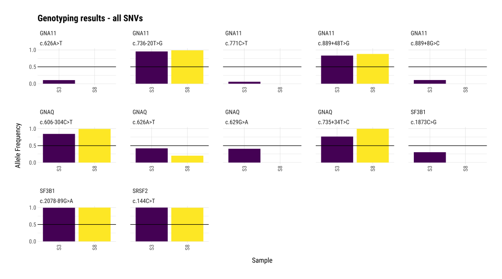
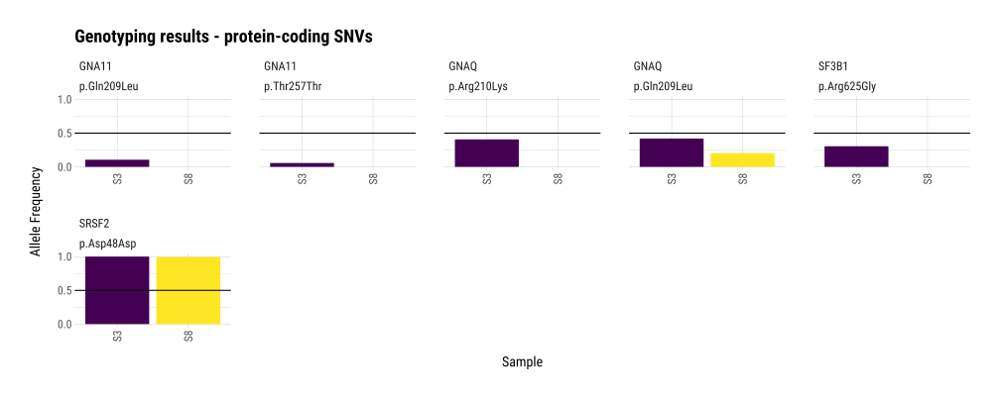
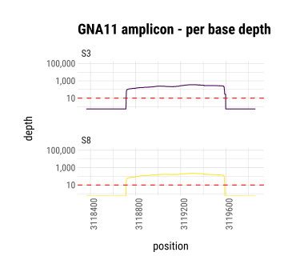
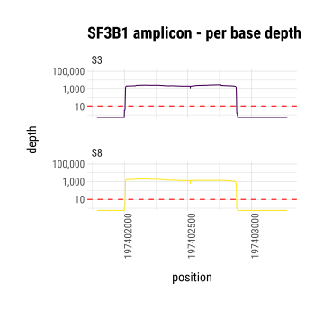
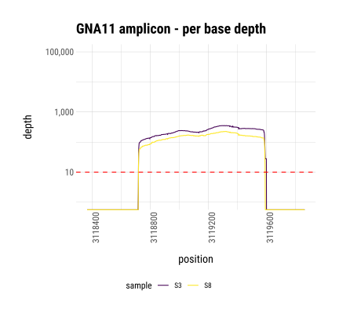
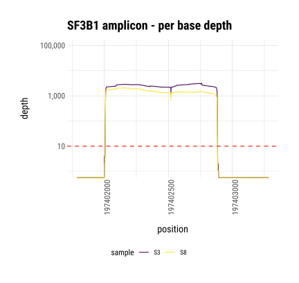

<h3 align="center"> NAGeno - Nanopore Amplicon GENOtyping</h3>

A comprehensive pipeline for SNV and indel genotyping on Nanopore Amplicon Sequencing data.

NAGeno starts with basecalled Nanopore Amplicon sequences and returns two overview genotyping tables (SNV and indel), a SNV genotype overview plot and more elaborate underlying files.
It works for multiplexed samples, as long as each barcode has only been used once.

[Publication](insert here)

## Table of contents
* [Introduction](#introduction)
* [Workflow](#workflow)
* [Installation](#installation)
* [Usage](#usage)
* [Tutorial](#tutorial)
* [Citation and Contribution](#citation-and-contribution)
* [License](#license)

## Introduction

**Accurate genotyping made simple.**

Identifying SNVs and indels is essential in molecular biology and clinical diagnostics. Sangersequencing—still the gold-standard for its high accuracy—requires manual inspection to avoid artifacts and catch low-frequency variants. However, it often struggles in GC-rich or highly repetitive regions. NGS provides even higher accuracy with automated analysis, but is typically excessive for small to medium-scale projects and routine lab workflows.

**NAGeno** - **N**anopore **A**mplicon **Geno**typing combines high accuracy even in GC and reptitive regions with Sanger-like simplicity while ensuring scalability making genotyping both robust and effortless.

## Workflow

NAGeno performs SNV and indel genotyping on fastq files of nanopore amplicon sequencing. Amplicons can cover regions of approx. 50 bp - 5 kb. In a fully automated workflow, we generate detailed tables for both SNVs and indels, along with an overview plot of SNVs per sample, by following these steps:

<div align="center">
    
</div>

_Created in BioRender._

## Installation

Clone this repository

```bash
git clone https://github.com/prireto/NAGeno.git

```

Two `.yml` files are included into the repository at `envs/scripts`. For the full functionality (i.e. analysis and plotting), both of them need to be created via

```bash
conda env create -f NAGeno/envs/nageno.yml
conda env create -f NAGeno/envs/nageno_plot.yml
conda activate nageno
```

> [!NOTE]
> Alternative to `conda`, `mamba` or `micromamba` can also be used for the creation of the environments which will be much faster. Since `nageno` ultimately uses the environments for some parts of the analysis, make sure that the command `conda activate nageno` works. Alternatively, make sure that you are setting `--manager` to your respective dependency manager (e.g. `micromamba`) while using the pipeline. 

Further, the somatic variant caller, **ClairS-TO**, and its models need to be installed manually, as explained [here](https://github.com/HKU-BAL/ClairS-TO). 

> [!WARNING]
> `clairs-to` searches for the models at `echo ${CONDA_PREFIX}/bin`. This unfortunately can not be changed easily and thus you need to make sure that `clairs-to_models`, `clairs-to_databases`, and `clairs-to_cna_data` exist in the bin-folder of the `nageno` environment. You can prevent this extra step by, as described above, activating the `nageno` environment first and then proceed with the manual `clairs-to` installation.

<details>
<summary>Condensed relevant information about the manual installation of ClairS-TO (click to expand)</summary>

```bash
# in case of a timeout error (Download error (28) Timeout was reached) try modifying timeout settings (works exactly like this only for mamba and conda)
#conda config --set remote_connect_timeout_secs 30
#conda config --set remote_read_timeout_secs 30 

git clone https://github.com/HKU-BAL/ClairS-TO.git
cd ClairS-TO

# make sure in clairs-to environment
# download pre-trained models and other resources
echo ${CONDA_PREFIX}
mkdir -p ${CONDA_PREFIX}/bin/clairs-to_models
mkdir -p ${CONDA_PREFIX}/bin/clairs-to_databases
mkdir -p ${CONDA_PREFIX}/bin/clairs-to_cna_data
wget http://www.bio8.cs.hku.hk/clairs-to/models/clairs-to_models.tar.gz
wget http://www.bio8.cs.hku.hk/clairs-to/databases/clairs-to_databases.tar.gz
wget http://www.bio8.cs.hku.hk/clairs-to/cna_data/reference_files.tar.gz
tar -zxvf clairs-to_models.tar.gz -C ${CONDA_PREFIX}/bin/clairs-to_models/
tar -zxvf clairs-to_databases.tar.gz -C ${CONDA_PREFIX}/bin/clairs-to_databases/
tar -zxvf reference_files.tar.gz -C ${CONDA_PREFIX}/bin/clairs-to_cna_data/

./run_clairs_to --help
```

</details>

Remember to deactivate the nageno env before using NAGeno.

```bash
conda deactivate
```


## Usage

Generally, `nageno` can be used with two subcommands, `analysis` and `plot`. 

```bash
    Usage: nageno [SUBCOMMAND] [OPTIONS]

Subcommands:

  analysis             Runs genotype analysis. Use --help for mandatory and optional inputs.
  plot                 Runs post-analysis summary and plotting functions.

Use 'nageno [SUBCOMMAND] --help' for more information on a subcommand.

Typical execution order:
  1. Run the analysis subcommand with your parameters:
     nageno analysis [YOUR OPTIONS]

  2. After completion, run the plot subcommand with the same settings:
     nageno plot [YOUR OPTIONS]


```

#### Analysis

```bash
Usage: nageno analysis --dir DIR --anno ANNO --ref REF --bed BED --txfile TXFILE [OPTIONS]

Mandatory arguments:
  --dir                DIR                  Directory containing fastq files
  --anno               ANNO                 Sample sheet file
  --ref                REF                  Reference genome file - .fa file needed, .fai files needs to be present too
  --bed                BED                  BED file for reference
  --txfile             TXFILE               File for visualization - transcript annotation needs to match the SPEFF_REF, default is RefSeq (NM_...), can also be ENSEMBL (ENST...)

Optional arguments:
  --manager            MANAGER              Package manager used to activate environments (default: conda)
  --threads            THREADS              Number of cores to use (default: 1)
  --min-q              MIN_Q                Minimum base quality (default: 30)
  --max-u              MAX_U                Percentage of bases allowed below MIN_Q (default: 10)
  --mapq               MAPQ                 Minimum mapping quality (default: 50)
  --analysis-dir       DIR                  Directory for output (default: ./analysis)
  --ext                EXT                  Sample name extension (default: SQK-RBK114-24_barcode)
  --clairs-to-path     CLAIR_PATH           Absolute path to 'run_clairs_to' - depends on where ClairS-TO was installed. (default: run_clairs_to)
  --clairs-to-model    CLAIR_MODEL          Clairs-to model (default: ont_r10_dorado_sup_5khz)
  --snpeff-ref         SNPEFF_REF           SNPeff reference genome - should always be the same as the one used for alignment (default: GRCh38.p14)

```
> [!NOTE]
> Currently available clairs-to models are 'ont_r10_dorado_sup_4khz', 'ont_r10_dorado_hac_4khz', 'ont_r10_dorado_sup_5khz', 'ont_r10_dorado_sup_5khz_ss', 'ont_r10_dorado_sup_5khz_ssrs', 'ont_r10_guppy_sup_4khz', 'ont_r10_guppy_hac_5khz', 'ilmn' and 'hifi_revio'. They can be checked [here](https://github.com/HKU-BAL/ClairS-TO?tab=readme-ov-file#usage).

#### Plot

```bash
Usage: nageno plot --dir DIR --anno ANNO --txfile TXFILE [OPTIONS]

!!! Attention !!!

Make sure you are using the same options as for the analysis.
The generated output files will otherwise not be recognized properly.

Mandatory arguments:
  --dir                DIR                  Directory containing fastq files
  --anno               ANNO                 Sample sheet file
  --txfile             TXFILE               File for visualization
  --bed                BED                  BED file for reference

Optional arguments:
  --manager            MANAGER              Package manager used to activate environments (default: conda)
  --min-q              MIN_Q                Minimum base quality (default: 30)
  --max-u              MAX_U                Percentage of bases allowed below MIN_Q (default: 10)
  --mapq               MAPQ                 Minimum mapping quality (default: 50)
  --analysis-dir       DIR                  Directory for output (default: ./analysis)
  --clairs-to-model    CLAIR_MODEL          Clairs-to model (default: ont_r10_dorado_sup_5khz)

```

## Tutorial

Using the exemplary test data in `tutorial`, the correct setup can be confirmed and exemplary output can be generated:

```bash
nageno analysis \
  --dir tutorial/test_data/fastq \
  --anno tutorial/Src/barcode_assignment.tsv \
  --ref /path/to/ref/genome/hg38.fa \
  --bed tutorial/Src/geno_panel_v4.1.bed \
  --txfile tutorial/Src/tx.tsv \
  --analysis-dir tutorial/analysis \
  --threads 20 \
  --clairs-to-path /path/to/run_clairs_to
```

<details>
<summary>Potential installation errors:</summary>

- `[ERROR] file .../envs/nageno/bin/clairs-to_models/ont_r10_dorado_sup_5khz/pileup_affirmative.pkl not found`: Make sure that `clairs-to_models`, `clairs-to_databases`, and `clairs-to_cna_data` exist in the bin-folder of the `nageno` environment. => The best way to ensure that is by installing ClairS-TO while the nageno env is activated.
- `[ERROR] while connecting to https://snpeff.blob.corewindows.net/databases/v5_2snpEff_v5_2[refGenomeVersion].zip`: SnpEff usually downloads the required databases automatically. However, there have been occasional issues due to re-structuring in the past. In that case, try a manual download within the tool environment at `.../conda/envs/tool/share/snpeff-5.2-1/` via:

  ```bash
  conda activate nageno #snpeff runs in the nageno env
  java -Xmx4g -jar snpEff.jar download -v [refGenomeVersion]
  conda deactivate
  ```

  or use another database. All databases can be viewed with:

  ```bash
  conda activate nageno #snpeff runs in the nageno env
  java -Xmx4g -jar snpEff.jar databases
  conda deactivate
  ```

  The annotation database should always match the database previously used for annotation and variant calling. You can read more on that issue [here](https://www.biostars.org/p/296349/).

</details>


The `nageno plot` subfunction results in the creation of various different visualisations for the `nageno analysis` output. This is supposed to be used as a quick and comprehensive overview about the genotypes of your samples.

```bash

nageno plot \
  --dir tutorial/test_data/fastq \
  --anno tutorial/Src/barcode_assignment.tsv \
  --ref /path/to/ref/genome/hg38.fa \
  --bed tutorial/Src/geno_panel_v4.1.bed \
  --txfile tutorial/Src/tx.tsv \
  --analysis-dir tutorial/analysis \
  --threads 20 \
  --clairs-to-path /path/to/run_clairs_to
```

> [!TIP]
> `nageno plot` needs less arguments than `nageno analysis`. Since additional arguments are ignored, the quickest way to use the plotting functionality on your results is by replacing the `analysis` with the `plot` subcommand and re-run.

### Output
Output files and their respective visualisation for the provided test data are displayed below. Per sample vcf files, vcf collection files for all samples, filtered fastq and filtered bam files as well as more detailed bam depth data are saved in the analysis directory along with log files and html files generated by fastplong and SnpEff.

<details>
<summary>Table 1 – SNV genotyping results (all SNVs):</summary>

[`SNV_genotyping_results.tsv`](tutorial/test_output/SNV_genotyping_results.tsv)

| SAMPLE | GENE | CHROM | HGVS.p | HGVS.c | AF | POS | REF | ALT | GQ | DP | FILTER | GT | AD | QUAL | Annotation | Annotation_Impact | Feature_ID | mutGeneID.p | mutGeneID.c |
| --- | --- | --- | --- | --- | --- | --- | --- | --- | --- | --- | --- | --- | --- | --- | --- | --- | --- | --- | --- |
| S3 | SF3B1 | chr2 | NA | c.2078-89G>A | 0.9952 | 197402219 | C | T | 75 | 2721 | NonSomatic | 0/1 | 8;2708 | 75.5371 | intron_variant | MODIFIER | NM_012433.4 | NA | c.2078-89G>A_SF3B1 |
| S3 | SF3B1 | chr2 | p.Arg625Gly | c.1873C>G | 0.3057 | 197402760 | G | C | 64 | 2787 | PASS | 0/1 | 1933;852 | 64.2183 | missense_variant | MODERATE | NM_012433.4 | p.Arg625Gly_SF3B1 | c.1873C>G_SF3B1 |
| S3 | GNAQ | chr9 | NA | c.735+34T>C | 0.7689 | 77794429 | A | G | 88 | 3527 | NonSomatic | 0/1 | 814;2712 | 88.5596 | intron_variant | MODIFIER | NM_002072.5 | NA | c.735+34T>C_GNAQ |
| S3 | GNAQ | chr9 | p.Arg210Lys | c.629G>A | 0.4074 | 77794569 | C | T | 60 | 4534 | LowQual;StrandBias | 0/1 | 2658;1847 | 0 | missense_variant | MODERATE | NM_002072.5 | p.Arg210Lys_GNAQ | c.629G>A_GNAQ |
| S3 | GNAQ | chr9 | p.Gln209Leu | c.626A>T | 0.4198 | 77794572 | T | A | 52 | 4743 | LowQual;StrandBias | 0/1 | 2435;1991 | 0 | missense_variant | MODERATE | NM_002072.5 | p.Gln209Leu_GNAQ | c.626A>T_GNAQ |
| S3 | GNAQ | chr9 | NA | c.606-304C>T | 0.8471 | 77794896 | G | A | 51 | 6036 | NonSomatic | 0/1 | 920;5113 | 51.4948 | intron_variant | MODIFIER | NM_002072.5 | NA | c.606-304C>T_GNAQ |
| S3 | SRSF2 | chr17 | p.Asp48Asp | c.144C>T | 1 | 76737017 | G | A | 102 | 562 | NonSomatic | 1/1 | 0;562 | 102 | synonymous_variant | LOW | NM_001195427.2 | p.Asp48Asp_SRSF2 | c.144C>T_SRSF2 |
| S3 | GNA11 | chr19 | p.Gln209Leu | c.626A>T | 0.1061 | 3118944 | A | T | 21 | 198 | PASS | 0/1 | 176;21 | 21.1036 | missense_variant | MODERATE | NM_002067.5 | p.Gln209Leu_GNA11 | c.626A>T_GNA11 |
| S3 | GNA11 | chr19 | NA | c.736-20T>G | 0.9537 | 3119186 | T | G | 88 | 216 | NonSomatic | 0/1 | 8;206 | 88.305 | intron_variant | MODIFIER | NM_002067.5 | NA | c.736-20T>G_GNA11 |
| S3 | GNA11 | chr19 | p.Thr257Thr | c.771C>T | 0.0575 | 3119241 | C | T | 17 | 313 | NonSomatic | 0/1 | 295;18 | 17.4944 | synonymous_variant | LOW | NM_002067.5 | p.Thr257Thr_GNA11 | c.771C>T_GNA11 |
| S3 | GNA11 | chr19 | NA | c.889+8G>C | 0.1087 | 3119367 | G | C | 21 | 322 | NonSomatic | 0/1 | 287;35 | 21.6758 | splice_region_variant&intron_variant | LOW | NM_002067.5 | NA | c.889+8G>C_GNA11 |
| S3 | GNA11 | chr19 | NA | c.889+48T>G | 0.8321 | 3119407 | T | G | 47 | 280 | NonSomatic | 0/1 | 17;233 | 47.9067 | intron_variant | MODIFIER | NM_002067.5 | NA | c.889+48T>G_GNA11 |
| S8 | SF3B1 | chr2 | NA | c.2078-89G>A | 0.9995 | 197402219 | C | T | 75 | 1885 | NonSomatic | 0/1 | 1;1884 | 75.0965 | intron_variant | MODIFIER | NM_012433.4 | NA | c.2078-89G>A_SF3B1 |
| S8 | GNAQ | chr9 | NA | c.735+34T>C | 0.9983 | 77794429 | A | G | 89 | 1185 | NonSomatic | 0/1 | 2;1183 | 89.5603 | intron_variant | MODIFIER | NM_002072.5 | NA | c.735+34T>C_GNAQ |
| S8 | GNAQ | chr9 | p.Gln209Leu | c.626A>T | 0.2031 | 77794572 | T | A | 53 | 1541 | PASS | 0/1 | 1219;313 | 53.6384 | missense_variant | MODERATE | NM_002072.5 | p.Gln209Leu_GNAQ | c.626A>T_GNAQ |
| S8 | GNAQ | chr9 | NA | c.606-304C>T | 0.9942 | 77794896 | G | A | 51 | 2233 | NonSomatic | 0/1 | 13;2220 | 51.4754 | intron_variant | MODIFIER | NM_002072.5 | NA | c.606-304C>T_GNAQ |
| S8 | SRSF2 | chr17 | p.Asp48Asp | c.144C>T | 0.9956 | 76737017 | G | A | 102 | 684 | NonSomatic | 0/1 | 3;681 | 102 | synonymous_variant | LOW | NM_001195427.2 | p.Asp48Asp_SRSF2 | c.144C>T_SRSF2 |
| S8 | GNA11 | chr19 | NA | c.736-20T>G | 0.9868 | 3119186 | T | G | 88 | 152 | NonSomatic | 0/1 | 2;150 | 88.6584 | intron_variant | MODIFIER | NM_002067.5 | NA | c.736-20T>G_GNA11 |
| S8 | GNA11 | chr19 | NA | c.889+48T>G | 0.88 | 3119407 | T | G | 53 | 175 | NonSomatic | 0/1 | 2;154 | 53.0168 | intron_variant | MODIFIER | NM_002067.5 | NA | c.889+48T>G_GNA11 |

</details>

#### Allele frequency plot (all SNVs):
<p align="left">
  
</p>


<details>
<summary>Table 2 – SNV genotyping results (protein-coding SNVs):</summary>

[`Prot_coding_SNV_genotyping_results.tsv`](tutorial/test_output/Prot_coding_SNV_genotyping_results.tsv)


| SAMPLE | GENE | CHROM | HGVS.p | HGVS.c | AF | POS | REF | ALT | GQ | DP | FILTER | GT | AD | QUAL | Annotation | Annotation_Impact | Feature_ID | mutGeneID.p | mutGeneID.c |
| --- | --- | --- | --- | --- | --- | --- | --- | --- | --- | --- | --- | --- | --- | --- | --- | --- | --- | --- | --- |
| S3 | SF3B1 | chr2 | p.Arg625Gly | c.1873C>G | 0.3057 | 197402760 | G | C | 64 | 2787 | PASS | 0/1 | 1933;852 | 64.2183 | missense_variant | MODERATE | NM_012433.4 | p.Arg625Gly_SF3B1 | c.1873C>G_SF3B1 |
| S3 | GNAQ | chr9 | p.Arg210Lys | c.629G>A | 0.4074 | 77794569 | C | T | 60 | 4534 | LowQual;StrandBias | 0/1 | 2658;1847 | 0 | missense_variant | MODERATE | NM_002072.5 | p.Arg210Lys_GNAQ | c.629G>A_GNAQ |
| S3 | GNAQ | chr9 | p.Gln209Leu | c.626A>T | 0.4198 | 77794572 | T | A | 52 | 4743 | LowQual;StrandBias | 0/1 | 2435;1991 | 0 | missense_variant | MODERATE | NM_002072.5 | p.Gln209Leu_GNAQ | c.626A>T_GNAQ |
| S3 | SRSF2 | chr17 | p.Asp48Asp | c.144C>T | 1 | 76737017 | G | A | 102 | 562 | NonSomatic | 1/1 | 0;562 | 102 | synonymous_variant | LOW | NM_001195427.2 | p.Asp48Asp_SRSF2 | c.144C>T_SRSF2 |
| S3 | GNA11 | chr19 | p.Gln209Leu | c.626A>T | 0.1061 | 3118944 | A | T | 21 | 198 | PASS | 0/1 | 176;21 | 21.1036 | missense_variant | MODERATE | NM_002067.5 | p.Gln209Leu_GNA11 | c.626A>T_GNA11 |
| S3 | GNA11 | chr19 | p.Thr257Thr | c.771C>T | 0.0575 | 3119241 | C | T | 17 | 313 | NonSomatic | 0/1 | 295;18 | 17.4944 | synonymous_variant | LOW | NM_002067.5 | p.Thr257Thr_GNA11 | c.771C>T_GNA11 |
| S8 | GNAQ | chr9 | p.Gln209Leu | c.626A>T | 0.2031 | 77794572 | T | A | 53 | 1541 | PASS | 0/1 | 1219;313 | 53.6384 | missense_variant | MODERATE | NM_002072.5 | p.Gln209Leu_GNAQ | c.626A>T_GNAQ |
| S8 | SRSF2 | chr17 | p.Asp48Asp | c.144C>T | 0.9956 | 76737017 | G | A | 102 | 684 | NonSomatic | 0/1 | 3;681 | 102 | synonymous_variant | LOW | NM_001195427.2 | p.Asp48Asp_SRSF2 | c.144C>T_SRSF2 |

</details>

#### Allele frequency plot (protein-coding SNVs):
<p align="left">
  
</p>


<details>
<summary>Table 3 – Indel genotyping results:</summary>

[`Indel_genotyping_results.tsv`](tutorial/test_output/Indel_genotyping_results.tsv)
| SAMPLE | CHROM | AF | POS | REF | ALT | GQ | DP | FILTER | GT | AD | QUAL |
| --- | --- | --- | --- | --- | --- | --- | --- | --- | --- | --- | --- |
| S8 | chr17 | 0.1902 | 76736863 | GGTGTGAGTCCGGGGGGCGGCCGTA | G | 24 | 594 | PASS | 0/1 | 479;113 | 24.9978 |

</details>

<details>
<summary>Table 4 – Summary of depth statistics:</summary>

[`Summary_depth_stats.tsv`](tutorial/test_output/depth/Summary_depth_stats.tsv)

| sample | contig | gene | median | mean |
| --- | --- | --- | --- | --- |
| S3 | chr17 | SRSF2 | 393 | 420.05 |
| S3 | chr19 | GNA11 | 238 | 237.53 |
| S3 | chr2 | SF3B1 | 2537 | 2518.72 |
| S3 | chr9 | GNAQ | 5992 | 5406.32 |
| S8 | chr17 | SRSF2 | 458 | 474.01 |
| S8 | chr19 | GNA11 | 160 | 152.73 |
| S8 | chr2 | SF3B1 | 1427 | 1538.44 |
| S8 | chr9 | GNAQ | 2154 | 1874.96 |

</details>

#### Per sample, per gene depth plots exemplarily displayed for two genes:
<table>
  <tr>
    <td></td>
    <td></td>
  </tr>
  <tr>
    <td></td>
    <td></td>
  </tr>
</table>


## Citation
NAGeno has been described and benchmarked here:
[Publication](BioRXive link / doi)

Please cite NAGeno if you use it in your analysis.
[BibTex key.]

## Contribution
We welcome all forms of input, new ideas, user feedback, or performance improvements. If you come across any bugs or unexpected behavior, we encourage you to open an issue and include relevant error messages or context to help us troubleshoot efficiently.

## License

This project is licensed under the [Apache License 2.0](LICENSE).
[](LICENSE)
